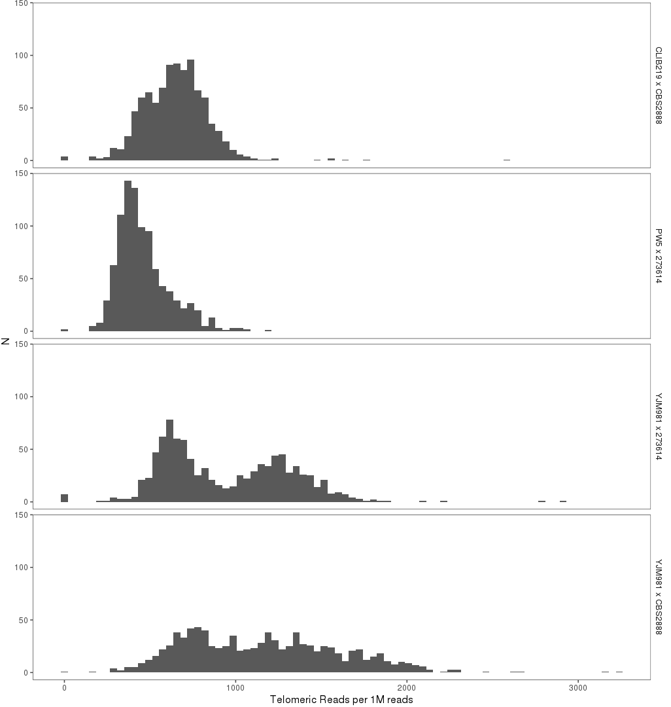
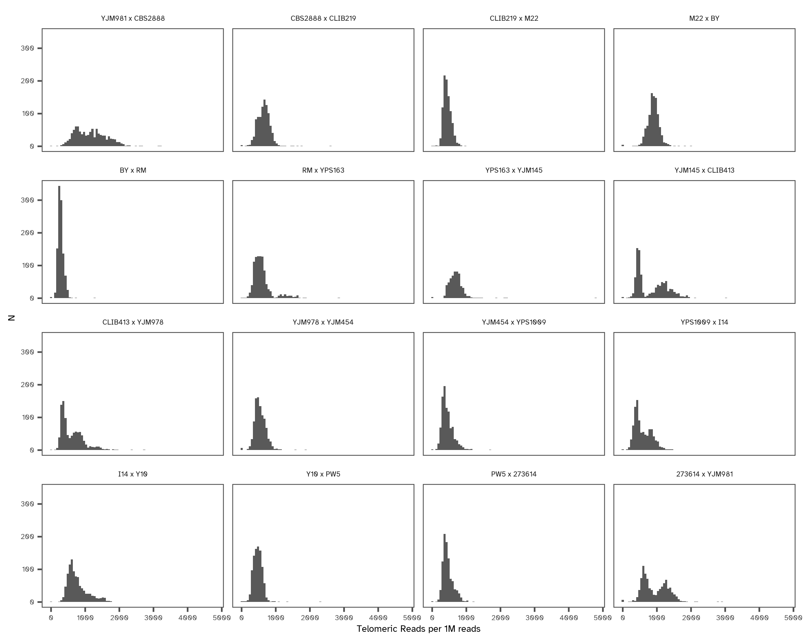

# Yeast Telomere Read Counts

For a first pass, do crude check of 'telomere-like reads' for all individuals in crosses containing YJM981.

| Strain1 | Strain2 | SRA run ID |
|:--------|:--------|:-----------|
| YJM981  | CBS2888 | SRR9330808 |
| CLIB219 | CBS2888 | SRR9330831 |
| YJM981  | 273614  | SRR9330809 |
| PW5     | 273614  | SRR9330830 |

[`count-telomeric-seqs.sh`](count-telomeric-seqs.sh) takes a single argument, the SRA run of interest, and 
unzips all relevent `fastq` files to an `lscratch` disk allocation. Then, it counts the number of reads
within a sample's `fastq` file that match a regular expression crudely identifying telomere-like sequences.
The regular expression is

```bash
"(CA|CCA|CCCA){8,}|(TG|TGG|TGGG){8,}"
```

which matches 8+ repeats of the telomeric unit `[C,CC,CCC]A` or `T[G,GG,GGG]` then taking the fraction of reads that are telomere-like multiplied by 1M to get RPM (reads per million).

Plotting the resulting data with [`plot-RPM-distributions.R`](plot-RPM-distributions.R)



The crosses with YJM981 seem to be bimodal, but the additional peak appears to be higher than for crosses without YJM981.

Then let's just go ahead and count for all crosses:
```bash
sbatch count-telomeric-seqs.sh SRR9330808
sbatch count-telomeric-seqs.sh SRR9330831
sbatch count-telomeric-seqs.sh SRR9330809
sbatch count-telomeric-seqs.sh SRR9330830
sbatch count-telomeric-seqs.sh SRR9330832
sbatch count-telomeric-seqs.sh SRR9330811
sbatch count-telomeric-seqs.sh SRR9330837
sbatch count-telomeric-seqs.sh SRR9330810
sbatch count-telomeric-seqs.sh SRR9330836
sbatch count-telomeric-seqs.sh SRR9330813
sbatch count-telomeric-seqs.sh SRR9330815
sbatch count-telomeric-seqs.sh SRR9330812
sbatch count-telomeric-seqs.sh SRR9330833
sbatch count-telomeric-seqs.sh SRR9330814
sbatch count-telomeric-seqs.sh SRR9330817
sbatch count-telomeric-seqs.sh SRR9330816
```


